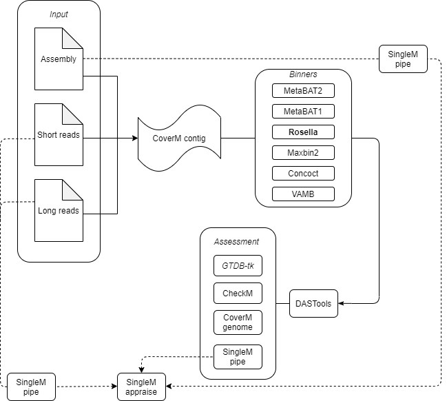

[](http://bioconda.github.io/recipes/aviary/README.html)


[](https://doi.org/10.5281/zenodo.10806928)


# Aviary
An easy to use for wrapper for a robust snakemake pipeline for metagenomic short-read, long-read, and hybrid assembly. 
Aviary also performs binning, annotation, strain diversity analyses,a nd provides users with an easy way to combine and 
dereplicate many aviary results with rapidity. The pipeline currently includes a series of distinct, yet flexible, modules
that can seamlessly communicate with each other. Each module can be run independently or as a single pipeline depending on provided input.

[Please refer to the full docs here](https://rhysnewell.github.io/aviary)

# Quick Installation

Your conda channels should be configured ideally in this order:
```
conda config --add channels defaults
conda config --add channels bioconda
conda config --add channels conda-forge
```

Your resulting `.condarc` file should look something like:
```
channels:
  - conda-forge
  - bioconda
  - defaults
```

#### Option 1: Install from Bioconda

Conda can handle the creation of the environment for you directly:

```
conda create -n aviary -c bioconda aviary
```

Or install into existing environment:
```
conda install -c bioconda aviary
```

#### Option 2: Install from pip

Create the environment using the `aviary.yml` file then install from pip:
```
conda env create -n aviary -f aviary.yml
conda activate aviary
pip install aviary-genome
```

#### Option 3: Install from source

Initial requirements for aviary can be downloaded using the `aviary.yml`:
```
git clone https://github.com/rhysnewell/aviary.git
cd aviary
conda env create -n aviary -f aviary.yml
conda activate aviary
pip install -e .
```
The `aviary` executable can then be run from any directory. Since the code in
this directory is then used for running, any updates made there will be
immediately available. We recommend this mode for developing and debugging
aviary.

## Checking installation
Whatever option you choose, running `aviary --help` should return the following
output:

```
                    ......:::::: AVIARY ::::::......

           A comprehensive metagenomics bioinformatics pipeline

Metagenome assembly, binning, and annotation:
        assemble  - Perform hybrid assembly using short and long reads, 
                    or assembly using only short reads
        recover   - Recover MAGs from provided assembly using a variety 
                    of binning algorithms 
        annotate  - Annotate MAGs using EggNOG and GTBD-tk
        genotype  - Perform strain diversity analysis of MAGs using Lorikeet
        complete  - Runs each stage of the pipeline: assemble, recover, 
                    annotate, genotype in that order.
        cluster   - Combines and dereplicates the MAGs from multiple Aviary runs
                    using Galah

Isolate assembly, binning, and annotation:
        isolate   - Perform isolate assembly **PARTIALLY COMPLETED**
        
Utility modules:
        configure - Set or overwrite the environment variables for future runs.

```

## Databases

Aviary uses programs which require access to locally stored databases. 
These databases can be quite large, as such we recommend setting up one instance of Aviary and these databases per machine or machine cluster.

The **required** databases are as follows:
* [GTDB](https://gtdb.ecogenomic.org/downloads)
* [EggNog](https://github.com/eggnogdb/eggnog-mapper/wiki/eggNOG-mapper-v2.1.5-to-v2.1.8#setup)
* [CheckM2](https://github.com/chklovski/CheckM2)
* [SingleM](https://wwood.github.io/singlem/)

### Installing databases

Aviary can handle the download and installation of these databases via use of the `--download` flag. Using `--download`
will download and install the databases into the folders corresponding to their associated environment variables. Aviary will
ask you to set these environment variables upon first running and if they are not already available. Otherwise, users can use
the `aviary configure` subcommand to reset the environment variables:

```commandline
aviary configure -o logs/ --eggnog-db-path /shared/db/eggnog/ --gtdb-path /shared/db/gtdb/ --checkm2-db-path /shared/db/checkm2db/ --singlem-metapackage-path /shared/db/singlem/ --download
```

This command will check if the databases exist at those given locations, if they don't then aviary will download and change
the conda environment variables to match those paths. 

**N.B.** Again, these databases are VERY large. Please talk to your sysadmin/bioinformatics specialist about setting a shared
location to install these databases to prevent unnecessary storage use. Additionally, the `--download` flag can be used within
any aviary module to check that databases are configured properly.

### Environment variables

Upon first running Aviary, you will be prompted to input the location for several database folders if
they haven't already been provided. If at any point the location of these folders change you can
use the the `aviary configure` module to update the environment variables used by aviary.

These environment variables can also be configured manually, just set the following variables in your `.bashrc` file:
```
export GTDBTK_DATA_PATH=/path/to/gtdb/gtdb_release220/db/ # https://gtdb.ecogenomic.org/downloads
export EGGNOG_DATA_DIR=/path/to/eggnog-mapper/2.1.8/ # https://github.com/eggnogdb/eggnog-mapper/wiki/eggNOG-mapper-v2.1.5-to-v2.1.8#setup
export SINGLEM_METAPACKAGE_PATH=/path/to/singlem_metapackage.smpkg/
export CHECKM2DB=/path/to/checkm2db/
export CONDA_ENV_PATH=/path/to/conda/envs/
```

# Workflow



# Citations
If you use aviary then please be aware that you are using a great number of other programs and aviary wrapping around them.
You should cite all of these tools as well, or whichever tools you know that you are using. To make this easy for you
we have provided the following list of citations for you to use in alphabetical order. This list will be updated as new
modules are added to aviary.

A constantly updating list of citations can be found in the [Citations document](https://rhysnewell.github.io/aviary/citations).

# License

Code is [GPL-3.0](LICENSE)
