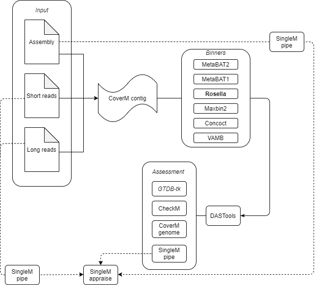

[](http://bioconda.github.io/recipes/aviary/README.html)


[](https://doi.org/10.5281/zenodo.10806928)


# Aviary

An easy to use for wrapper for a robust snakemake pipeline for metagenomic short-read, long-read, and hybrid assembly.
Aviary also performs binning, annotation, and provides users with an easy way to combine and dereplicate many aviary
results with rapidity. The pipeline currently includes a series of distinct, yet flexible, modules that can seamlessly
communicate with each other. Each module can be run independently or as a single pipeline depending on provided input.

[Please refer to the full docs here](https://rhysnewell.github.io/aviary)

## Quick Installation

Your conda channels should be configured ideally in this order:

```bash
conda config --add channels defaults
conda config --add channels bioconda
conda config --add channels conda-forge
```

Your resulting `.condarc` file should look something like:

```bash
channels:
  - conda-forge
  - bioconda
  - defaults
```

### Option 1: Install from Bioconda

Conda can handle the creation of the environment for you directly:

```bash
conda create -n aviary -c bioconda aviary
```

Or install into existing environment:

```bash
conda install -c bioconda aviary
```

### Option 2: Install from pip

Create the environment using the `admin/requirements.txt` file then install from pip:

```bash
conda env create -n aviary -f admin/requirements.txt
conda activate aviary
pip install aviary-genome
```

### Option 3: Install from source

This method can be somewhat complicated, as you can see below, but it allows for easier/faster development and debugging of aviary itself.

#### Clone
To install from source, we recommend using [pixi](https://pixi.sh/). First clone
the aviary repository from GitHub:

```bash
git clone https://github.com/rhysnewell/aviary.git
cd aviary
```

#### Create aviary/.pixi (possibly symlinked to faster disk)
In the source directory, create the `aviary/.pixi` directory to hold pixi environments. Without this, `.pixi` is symlinked to `aviary/.pixi` within the checkout, which does not exist. So `pixi run ..` trips over that dead link.

This can be done by simply running:
```bash
mkdir -p aviary/.pixi
```

For those at CMR, you can instead run:
```bash
cd aviary && pixi_cmr_init.py && cd -
```


#### Post-installation of aviary
Then run postinstall so `aviary` can be run as a script. The `postinstall` task creates symlinks in the parent directory to allow running aviary directly via `pixi run aviary ...` in subsequent uses.
```bash
pixi run postinstall
```

When installed from source this way, aviary is installed in an "editable" way (similar to `pip install -e .`), meaning that any changes made to aviary source are immediately available via the `aviary` command. This is useful for development and debugging.

If you see something like the following error, you might have missed the previous step?
```
Error:   × Failed to create .pixi/ directory at .../aviary/.pixi
  ╰─▶ File exists (os error 17)
```

#### Running aviary from source
Then aviary can be run using `pixi run` (or via `pixi shell`).
```bash
pixi run aviary --help
```

#### Databases when running from source
As well as the standard method for defining database paths (e.g. `CHECKM2DB`), databases can be symlinked from a `db/` directory in the aviary repository. An activation hook then ensures that these are available when in the pixi environments. To do this, create a `db/` directory in the aviary repository and symlink the required databases into it. For example, as of writing:

```bash
$ ls db -l
lrwxrwxrwx - woodcrob 23 Apr 07:56 2.1.3 -> /mnt/hpccs01/work/microbiome/db/eggnog-mapper/2.1.3
lrwxrwxrwx - woodcrob 23 Apr 07:55 2015_01_16_v2 -> /work/microbiome/db/checkm/2015_01_16_v2
lrwxrwxrwx - woodcrob 23 Apr 07:54 CheckM2_database -> /work/microbiome/db/CheckM2_database/uniref100.KO.1.dmnd
lrwxrwxrwx - woodcrob 23 Apr 07:57 2024-3-28-GTDB214.1+humanT2T -> /work/microbiome/db/metabuli/2024-3-28-GTDB214.1+humanT2T/
lrwxrwxrwx - woodcrob 23 Apr 07:56 release226 -> /work/microbiome/db/gtdb/gtdb_release226/auxillary_files/gtdbtk_package/full_package/release226
lrwxrwxrwx - woodcrob 23 Apr 07:55 S5.4.0.GTDB_r226.metapackage_20250331.smpkg.zb -> /work/microbiome/db/singlem/S5.4.0.GTDB_r226.metapackage_20250331.smpkg.zb
```

To check the expected database symlink names, see `admin/set_env_vars.sh` in the
aviary repository. The advantage of this approach is that locations of the
databases are not tracked in the repository, which is advantageous as they are specific to the
computing cluster of the user.

## Checking installation

Whatever option you choose, running `aviary --help` should return the following
output:

```bash
                    ......:::::: AVIARY ::::::......

           A comprehensive metagenomics bioinformatics pipeline

Metagenome assembly, binning, and annotation:
        assemble  - Perform hybrid assembly using short and long reads, 
                    or assembly using only short reads
        recover   - Recover MAGs from provided assembly using a variety 
                    of binning algorithms 
        annotate  - Annotate MAGs using EggNOG and GTBD-tk
        complete  - Runs each stage of the pipeline: assemble, recover, 
                    annotate in that order.
        cluster   - Combines and dereplicates the MAGs from multiple Aviary runs
                    using Galah

Isolate assembly, binning, and annotation:
        isolate   - Perform isolate assembly **PARTIALLY COMPLETED**
        
Utility modules:
        configure - Set or overwrite the environment variables for future runs.

```

## Databases

Aviary uses programs which require access to locally stored databases. 
These databases can be quite large, as such we recommend setting up one instance of Aviary and these databases per machine or machine cluster.

The **required** databases are as follows:

* [GTDB](https://gtdb.ecogenomic.org/downloads)
* [EggNog](https://github.com/eggnogdb/eggnog-mapper/wiki/eggNOG-mapper-v2.1.5-to-v2.1.8#setup)
* [CheckM2](https://github.com/chklovski/CheckM2)
* [SingleM](https://wwood.github.io/singlem/)

Optional databases include:

* [Metabuli](https://github.com/steineggerlab/Metabuli): for the optional TaxVAMB binner

### Installing databases

Aviary can handle the download and installation of these databases via use of the `--download` flag. Using `--download`
will download and install the databases into the folders corresponding to their associated environment variables. Aviary will
ask you to set these environment variables upon first running and if they are not already available. Otherwise, users can use
the `aviary configure` subcommand to reset the environment variables:

```bash
aviary configure -o logs/ --eggnog-db-path /shared/db/eggnog/ --gtdb-path /shared/db/gtdb/ --checkm2-db-path /shared/db/checkm2db/ --singlem-metapackage-path /shared/db/singlem/ --download
```

This command will check if the databases exist at those given locations, if they don't then aviary will download and change
the conda environment variables to match those paths. 

**N.B.** Again, these databases are VERY large. Please talk to your sysadmin/bioinformatics specialist about setting a shared
location to install these databases to prevent unnecessary storage use. Additionally, the `--download` flag can be used within
any aviary module to check that databases are configured properly.

### Environment variables

Upon first running Aviary, you will be prompted to input the location for several database folders if
they haven't already been provided. If at any point the location of these folders change you can
use the `aviary configure` module to update the environment variables used by aviary.

These environment variables can also be configured manually, just set the following variables in your `.bashrc` file:

```bash
export GTDBTK_DATA_PATH=/path/to/gtdb/gtdb_release220/db/ # https://gtdb.ecogenomic.org/downloads
export EGGNOG_DATA_DIR=/path/to/eggnog-mapper/2.1.8/ # https://github.com/eggnogdb/eggnog-mapper/wiki/eggNOG-mapper-v2.1.5-to-v2.1.8#setup
export SINGLEM_METAPACKAGE_PATH=/path/to/singlem_metapackage.smpkg/
export CHECKM2DB=/path/to/checkm2db/uniref100.KO.1.dmnd
```

# Workflow



# Citations

If you use aviary then please be aware that you are using a great number of other programs and aviary wrapping around them.
You should cite all of these tools as well, or whichever tools you know that you are using. To make this easy for you
we have provided the following list of citations for you to use in alphabetical order. This list will be updated as new
modules are added to aviary.

A constantly updating list of citations can be found in the [Citations document](https://rhysnewell.github.io/aviary/citations).

# License

Code is [GPL-3.0](LICENSE)
