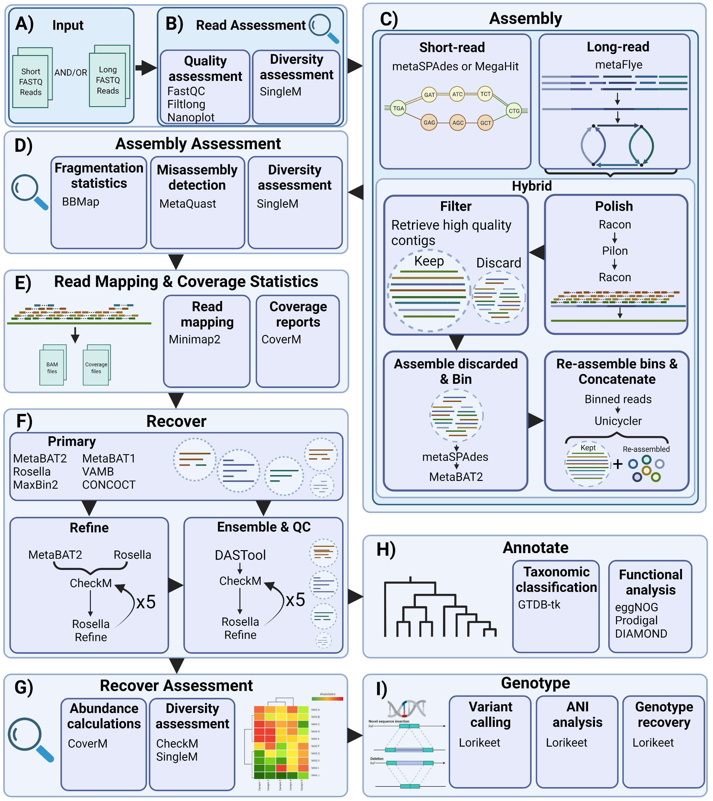

# Aviary
An easy to use for wrapper for a robust snakemake pipeline for metagenomic hybrid assembly, binning, and annotation. 
The pipeline currently includes a step-down iterative 
hybrid assembler (Previously SlamM), an isolate hybrid assembler, a quality control module and a 
comprehensive binning pipeline. Each module can be run independently or as a single pipeline depending on provided input.

Future modules will include:
- Annotation - Annotate your MAGs with metabolic pathways
- Strain analysis - Recover strain level variation in your MAGs using a suite of tools

# Index

1. [Installation](#installation)
    - [Requirements](#requirements)
2. [Module details](#module-details)
3. [Usage](#usage)
    - [Basic usage](#basic-usage)
    - [Advanced usage](#advanced-usage)
    - [Helpful parameters](#helpful-parameters-and-commands)
4. [Workflow](#workflow)
5. [Troubleshooting](#troubleshooting)
6. [Citations](#citations)


# Installation

```
git clone https://github.com/rhysnewell/aviary.git
cd aviary
conda env create -n aviary -f aviary.yml
conda activate aviary
pip install -e .
aviary --help
```

The resulting output should contain a list of the available aviary modules:
```

                    ......:::::: AVIARY ::::::......

A comprehensive metagenomics bioinformatics pipeline

Metagenome assembly, binning, and annotation:
        cluster   - Clusters and dereplicates bins across multiple aviary runs
        assemble  - Perform hybrid assembly using short and long reads,
                    or assembly using only short reads
        recover   - Recover MAGs from provided assembly using a variety
                    of binning algorithms
        annotate  - Annotate MAGs **TBC**
        genotype  - Perform strain level analysis of MAGs **TBC**
        complete  - Runs each stage of the pipeline: assemble, recover,
                    annotate, genotype in that order.

Isolate assembly, binning, and annotation:
        isolate   - Perform isolate assembly **PARTIALLY COMPLETED**

Utility modules:
        configure - Set or overwrite the environment variables for future runs.


```

Upon first running aviary you will be prompted to input the location for where you would like
your conda environments to be stored, the GTDB release installed on your system, the location of your
EnrichM database, and the location of your BUSCO database. These locations will be stored as environment
variables, but for aviary to be able to use those environment variables you will have to either source your .bashrc
or reactivate your conda environment depending on whether you installed aviary within a conda environment or not:

```
conda deactivate; conda activate aviary

OR

source ~/.bashrc
```

These environment variables can be reset using `aviary configure`

## Requirements

Your conda channels should be configured ideally in this order with strict channel priority order
turned on:
```
conda config --add channels defaults
conda config --add channels conda-forge
conda config --add channels bioconda
conda config --set channel_priority strict
```

Your resulting `.condarc` file should look something like:
```
channels:
  - conda-forge
  - bioconda
  - defaults
channel_priority: strict
```

Initial requirements for aviary can be downloaded using the `aviary.yml`:
```
conda env create -n aviary -f aviary.yml
```

## Databases

Aviary uses programs which require access to locally stored databases. These databases can be quite large, as such we recommend setting up one instance of Aviary and these databases per machine or machine cluster.

The **required** databases are as follows:
* [GTDB](https://gtdb.ecogenomic.org/downloads) Required for taxonomic annotation

The **optional** databases are as follows:
* [EggNog](https://github.com/eggnogdb/eggnog-mapper/wiki/eggNOG-mapper-v2.1.5-to-v2.1.7#setup) Will become required soon.

**If you do not have the optional databases installed, then when aviary asks you to specify these databse passes when configuring just press enter and specify no path.**

# Module details
|__method__ |__description__ |
| --- | --- |
|`cluster`|Dereplicate/choose representative genomes from multiple aviary runs|
|`assemble`|Perform quality control and assembly of provided reads. Will provide hybrid assembly if given long and short reads|
|`recover`|Recover MAGs from provided assembly using a variety of binning algorithms. Also perform quality checks on recovered MAGs and taxonomic classification.|
|`annotate`|Module under development|
|`genotype`|Module under development|
|`complete`|Performs the complete workflow up to last possible rule given the provided inputs|
|`isolate` |Performs hybrid isolate assembly. For use with isolated pure sequencing results.  |
|`configure` |Set or reset environment variables used by aviary  |

# Usage
## Basic Usage

To perform hybrid assembly:
```
aviary assemble -1 *.1.fq.gz -2 *.2.fq.gz --longreads *.nanopore.fastq.gz --long_read_type ont -t 24 -n 48
```
Aviary is compatible with both Nanopore and PacBio long read technologies. 
Note: Aviary can also perform assembly using just short or long reads as well.
```
aviary assemble -1 *.1.fq.gz -2 *.2.fq.gz -t 24 -n 48

OR

aviary assemble --longreads *.nanopore.fastq.gz --long_read_type ont -t 24 -n 48
```


To perform mag recovery:
```
aviary recover --assembly scaffolds.fasta -1 sr1.1.fq sr2.1.fq.gz -2 sr1.2.fq sr2.2.fq.gz --longreads nanopore.fastq.gz -z ont --output output_dir/ --max_threads 12 --n_cores 24 --gtdb_path /path/to/gtdb/release/
```
If no assembly file is provided, then aviary will first perform the assembly pipeline to produce an assembly using the 
input reads.

If at any point the Aviary workflow is interrupted, the pipeline can be restarted and pick up from the last completed
step.

## Advanced Usage

Often users are required to send long running jobs off on to high performance clusters. Aviary and snakemake are
perfectly compatible with clusters and can be sent off as either a single pipeline via PBS script or equivalent.
Alternatively, snakemake can send individual jobs in a pipeline off into a cluster to share the load across nodes. 
You can make use of this feature in Aviary via the `--snakemake-cmds` parameter, E.g.
```
aviary assemble -1 *.1.fq.gz -2 *.2.fq.gz --longreads *.nanopore.fastq.gz --long_read_type ont -t 24 -p 24 -n 24 --snakemake-cmds '--cluster qsub '
```
NOTE: The space after `--cluster qsub ` is required due to a strange quirk in how python's `argparse` module works.

## Helpful parameters and commands

### Environment variables
Upon first running Aviary, you will be prompted to input the location for several database folders if
they haven't already been provided. If at any point the location of these folders change you can
use the the `aviary configure` module to update the environment variables used by aviary.

These environment variables can also be configured manually, just set the following variables in your `.bashrc` file:
```
GTDBTK_DATA_PATH
ENRICHM_DB
BUSCO_DB
CONDA_ENV_PATH
```

Make sure to reactivate your conda environment or re-source your `.bashrc` for aviary to be able to access these variables.

### Thread control
Aviary has three thread contol options:

#### `-t, --threads`

- Controls how many threads any individual program can use. If set to 24, then each program that has threading options 
will use 24 threads when they run.

#### `-n, --n-cores, --n_cores`

- Controls how many cores (CPUs) snakemake will be given. If this value is set higher than `--threads`, then potentially
multiple programs will run concurrently providing a great boost in performance. If this value is not set then it defaults 
to being the same value as `--threads`

#### `-p, --pplacer-threads, --pplacer_threads`

- Pplacer is special and gets its own thread parameter. Why? Because it randomly deadlocks when given too many threads and 
can also be kind of memory intensive when given extra threads.

### RAM control

When performing assembly, users are required to estimate how much RAM they will need to use via `-m, --max-memory, --max_memory`

### Workflow control

Often users may not want to run a complete aviary module, as such specific rules can be targeted via the `-w, --workflow`
parameter. For example, if a user wanted to only run a specific binning algorithm then that rule can be specified directly:
```
aviary recover -w rosella --assembly scaffolds.fasta -1 sr1.1.fq sr2.1.fq.gz -2 sr1.2.fq sr2.2.fq.gz --longreads nanopore.fastq.gz --output output_dir/ --max_threads 12
```
NOTE: Every step up to the targeted rule still has to be run if it hasn't been run before. The specific rules that can be 
used can be found within each modules specific snakemake file.

# Workflow
The current complete workflow for aviary. This is constantly being updated and will eventually include and assembly stage and
post binning analysis of MAGs


# Troubleshooting

### qsub and pysam - ModuleNotFoundError
A known issue with using snakemake + pysam + qsub results in the a break in the pipeline. The issue arises because pysam 
does not activate correctly when using qsub by default. To fix this you just need to add the `-V ` parameter to your qsub
command.


# Citations
If you use aviary then please be aware that you are using a great number of other programs and aviary wrapping around them.
You should cite all of these tools as well, or whichever tools you know that you are using. To make this easy for you
we have provided the following list of citations for you to use in alphabetical order. This list will be updated as new
modules are added to aviary.

A constantly updating list of citations can be found in the [Citations document](CITATIONS.md).

# License

Code is [GPL-3.0](LICENSE)
